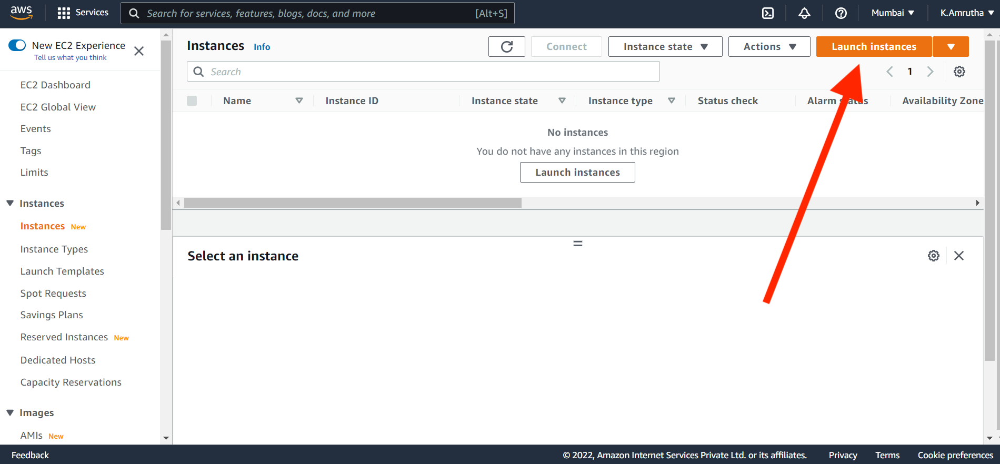
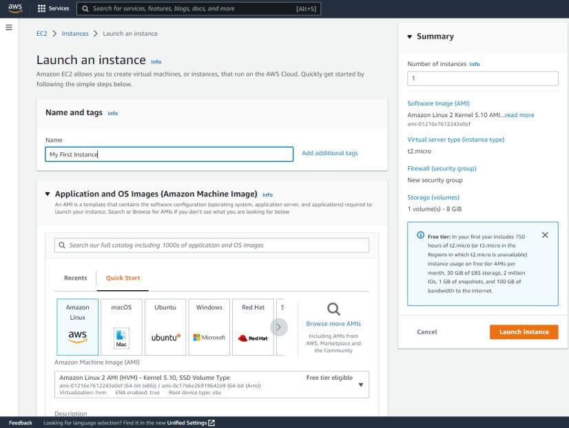
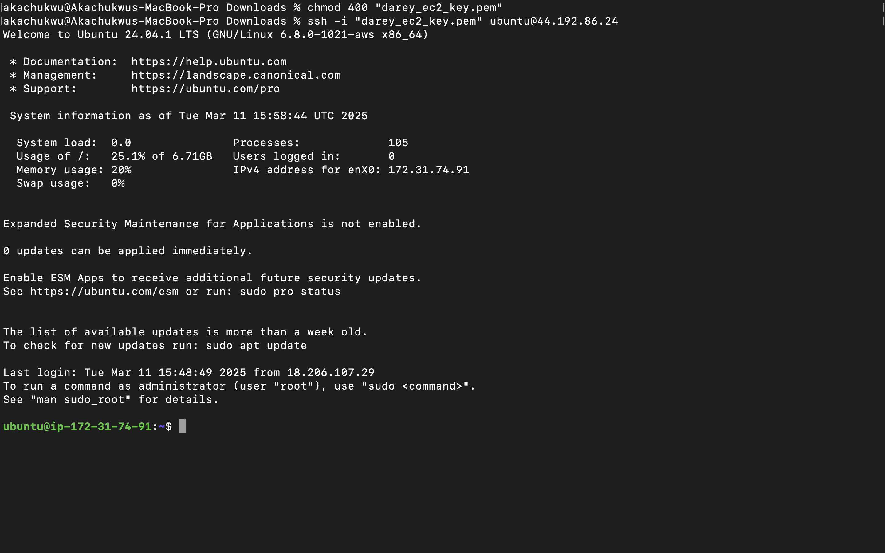

# Mini Project-Linux Fundamental 

## Table of Contents

1. Project Overview.

   - 1.1 Objectives 

2. Project Steps and Commands
   - 2.2 []


---

## 1. Project Overview
This project combines Linux fundamentals with cloud computing by focusing on creating and managing an Amazon EC2 instance. It includes learning essential Linux commands, file system navigation, and shell scripting while also covering how to launch and configure an EC2 instance on AWS. The project guides you through securely connecting to the EC2 instance locally via SSH, setting up permissions, and performing basic administrative tasks. This hands-on approach bridges the gap between Linux skills and cloud environments, providing a solid foundation for system administration and cloud computing.

## 1.1 Objectives
The objectives of this project are to understand Linux fundamentals, set up an EC2 instance, securely connect to it, perform Linux administration tasks on EC2, and integrate cloud and Linux skills.

### Purpose
The project guides you through securely connecting to the EC2 instance locally via SSH, setting up permissions, and performing basic administrative tasks.

### Requirements
This project requirement is setting up an EC2 instance and connecting via SSH.

### Use case
The use case is to provide a hands-on approach to learning Linux and cloud integration.


### Prerequisite
- AWS account registration and step up
- Basic Linux Commands

## 2. Project Steps and commands
### 2.1 Go to the EC2 page


** Navigate to the EC2 page where you manage the EC2 then click on launch instance; **

### 2.2 Complete the necessary file



Understand the various instance types, AMIs (Amazon Machine Images), and key pair configurations.


### 2.3 Connecting to server

```bash
   #move to the location of the .pem file
   cd Downloads
```

```bash
# Connect to the instance using SSH
ssh -i ~/.ssh/my-ec2-key ec2-user@<instance-public-ip>
```

Connecting our EC2 instance locally using SSH code above and the .pem





## 3. Troubleshooting (Common Issues and Solutions)

### 3.1. Connection Failed
**Issue:** Instances in the VPC cannot access the internet.
**Solution:**
- Locate your private key file. The key used to launch this instance is darey_ec2_key.pem

### 3.2. Mode to run the .pem
**Issue:** 
**Solution:**
- Run this command, if necessary, to ensure your key is not publicly viewable.
chmod 400 "darey_ec2_key.pem"

